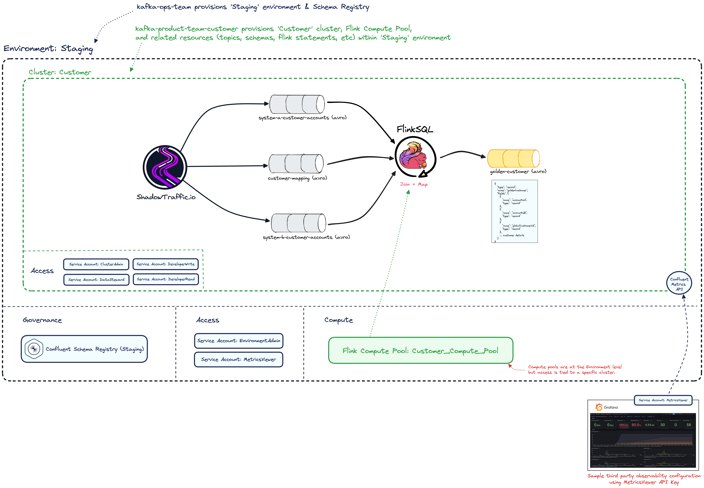

# Confluent Cloud

This repository contains a Terraform template to provision Confluent Cloud environments, clusters, topics, stream processing, and more.

## Table of Contents

1. [Environment Overview](#environment-overview)
2. [Prerequisites](#prerequisites)
3. [Repo Structure](#repo-structure)
4. [Getting Started](#getting-started)

## Environment Overview

> Image Source: [./assets/demo-env.excalidraw](./assets/demo-env.excalidraw)
