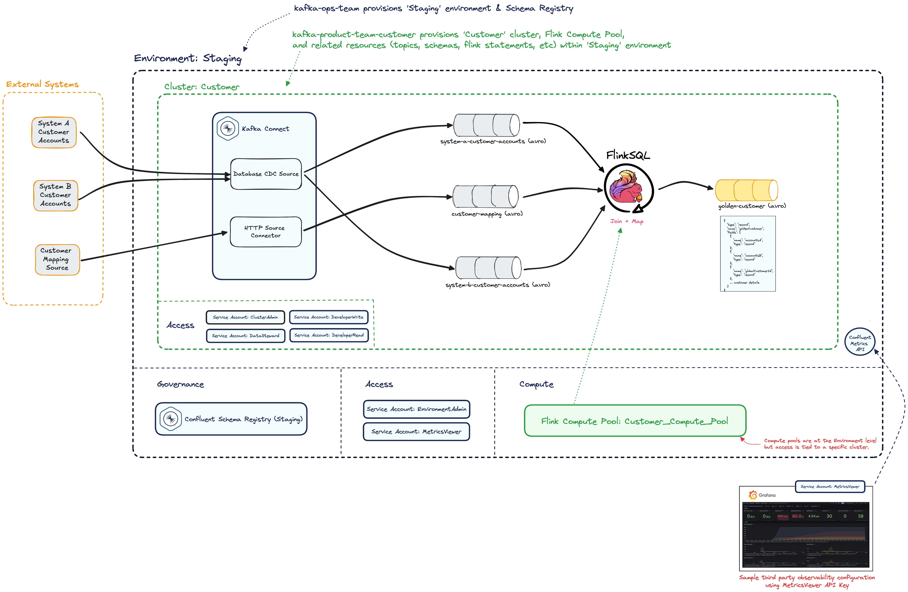

# Confluent Cloud

This repository contains a Terraform template to provision Confluent Cloud environments, clusters, topics, stream processing, and more.

## Table of Contents

1. [Environment Overview](#environment-overview)
2. [Prerequisites](#prerequisites)
3. [Repo Structure](#repo-structure)
4. [Getting Started](#getting-started)

## Environment Overview



## Prerequisites

1. [Sign up for Confluent Cloud](https://confluent.cloud/home) with your email.

> ⚠️️ Although you're now rolling in $400 of lush credits, be sure to tear your environment(s) down after each use.

2. [Create a Confluent Cloud API Key](https://registry.terraform.io/providers/confluentinc/confluent/latest/docs/guides/sample-project#create-a-cloud-api-key)

    > To solve the 🐥 🥚 problem, we need the initial API Key created manually that Terraform can leverage

   1. Open the Confluent Cloud Console and navigate to "API keys"
   2. Select "+ Add API key"
   3. To keep things simple, select "My account" to create a key that has all of your access permissions
      1. NOTE: In production, you would create a service account with specific permissions and generate the key from that
   4. Select "Cloud resource management" for your resource scope, click "Next"
   5. Enter Name: "Terraform API Key" and Description: "Used by Terraform to provision Cloud Resources", click "Create API key"  
   6. Click "Download API Key" (you'll these this when provisioning the cluster)

3. [Install Terraform CLI](https://developer.hashicorp.com/terraform/tutorials/aws-get-started/install-cli#install-terraform)

    > We don't click buttons around here. Everything will be provisioned through Terraform.

## Repo Structure

The `./template` folder contains a few key subfolders - in a real env, these would likely be separate repos. 

```txt
./template
├── kafka-environment  
│   └── main.tf                     # environment resources
│   └── topics.tf                   # topics
│   └── flink.tf                    # flink statements
│   ├── flink-statements
│   │   └── ... flink .sql files
│   ├── schemas
│   │   └── ... schema files
├── modules
│   ├── confluent_cloud_environment # shared module to provision environments
│   ├── product_team_avro_topic     # shared module to provision topics tied to an Avro schema
│   └── product_team_basic_cluster  # shared module to provision clusters & flink compute pools
├── observability
│   └── grafana-cloud.md            # guide on configuring grafana cloud to scrape confluent cloud Metrics API
└── shadowtraffic
    ├── license.env                 # shadowtraffic license details
    └── {domain}
        ├── config                  # holds generators, stages, connections, and other configurations
        ├── start-std-out.sh        # script to run shadowtraffic, dumping results to std out (for testing)
        └── start-kafka.sh          # script to run shadowtraffic, producing results to Kafka (configs required)
```

### kafka-environment

This repo (folder) holds the Confluent Cloud infrastructure and resources required for this demo.  We leverage [Terraform](https://developer.hashicorp.com/terraform) to deploy all of these resources with [Confluent provider](https://registry.terraform.io/providers/confluentinc/confluent/1.83.0)

The following resources will automatically created to give you a fully featured environment:

    * Environment
    * Clusters
    * Topics
    * Schemas
    * Flink Compute Pools
    * Service Accounts / ACLs
    * ... and more


### modules

This repo (folder) holds shared modules that are leveraged by both ops & product teams.

> Review each module's variables.tf for insight into the various knobs that are exposed on the resources.

Modules -

* `confluent_cloud_environment`: Provisions Confluent Cloud Environments & Stream Governance (Schema Registry)
* `product_team_avro_topic`: Provisions Avro Schema & Topic within a Cluster.
* `product_team_basic_cluster`: Provisions `basic` level Confluent Cloud Clusters within an Environment.

### Observability

Confluent Cloud provides a variety of tools to observe your pipelines but most teams will also leverage a third party tool that aggregates telemetry
across a wide variety of sources. This folder holds guides on setting up observability of the Confluent Cloud Metrics API from third party tools.

- ex. [Grafana Cloud](./template/observability/grafana-cloud.md)

### shadowtraffic

https://shadowtraffic.io/ enables rapid simulation of data into various data technologies.

Additional details on running shadowtraffic can be found in the [README](./template/shadowtraffic/README.md).

## Getting Started

The [Confluent Terraform Provider](https://registry.terraform.io/providers/confluentinc/confluent/latest/docs) needs your Confluent Cloud API Key/Secret to connect to the Organization you provisioned in the prereqs.

> Need an API Key/Secret? See the [Prerequisites Section](#prerequisites) at the top of this README.

There are two [Terraform variables](https://developer.hashicorp.com/terraform/language/values/variables) for these --> `confluent_cloud_api_key` && `confluent_cloud_api_secret`

When running `terraform plan/apply`, Terraform will prompt you for any variables that aren't set via defaults or environment variables.

To avoid the repetitive prompt, copy, paste game - set the environment variables below and Terraform will leverage them on each run.

```shell
export TF_VAR_confluent_cloud_api_key="<cloud_api_key>"
export TF_VAR_confluent_cloud_api_secret="<cloud_api_secret>"
```

### Provisioning Confluent Cloud **Environments**

First, provision your environments from the `kafka-environment` repo (folder).

1. `cd template/kafka-environment`
2. `terraform init`
3. `terraform apply` # approve after review, this may take a few minutes to complete
   - As of V1.80.0 of the Confluent Provider, you will receive a "Warning: Deprecated Resource" around Schema Registry. Ignore this.
   - As of V2.0.0 of the Confluent Provider, this Warning should be gone.
4. Confirm the Environments are created in your [Confluent Cloud](https://confluent.cloud/home) account

If needed, the `kafka-environment/outputs.tf/resource-ids` will emit a variety of useful identifiers, keys, & urls.

```bash
> terraform output resource-ids
            
<<EOT

====

Staging Environment ID:   env-kkv293
Staging Schema Registry ID:   def-3drm1o
Staging Schema Registry Rest Endpoint:   https://eiw-23932.us-east1.gcp.confluent.cloud
Staging MetricsViewer API Key: xxxxx:xxxxxxxx
Staging EnvironmentAdmin/AccountAdmin API Key:  Txxxxx:xxxxxxxx

Customer Cluster ID: xyz-g5n70n
Customer Flink Compute Pool ID: abc-1232ms
Customer Cluster Admin: xxxxx:xxxxxxxx

****************************
Metrics Scrape Job Configs
****************************
Flink Scrape Job URL:   https://api.telemetry.confluent.cloud/v2/metrics/cloud/export?resource.compute_pool.id=abc-1232ms
Cluster Scrape Job URL: https://api.telemetry.confluent.cloud/v2/metrics/cloud/export?resource.kafka.id=xyz-g5n70n

**************
Client Configs
**************

"bootstrap.servers": "SASL_SSL://pkc-619z3.us-east1.gcp.confluent.cloud:9092",

# Customer-Cluster-Developer-Write sasl jaas config
"sasl.jaas.config": "org.apache.kafka.common.security.plain.PlainLoginModule required username='xxxxx' password='xxxxxxxxxx';",

# Customer-Cluster-Developer-Read sasl jaas config
"sasl.jaas.config": "org.apache.kafka.common.security.plain.PlainLoginModule required username='xxxxx' password='xxxxxxxxxx';",

# schema registry
"schema.registry.url": "https://psrc-571gzn.us-east1.gcp.confluent.cloud",
"basic.auth.credentials.source": "USER_INFO",
"basic.auth.user.info": "xxxxx:xxxxxxxx",

**************
**************

Getting Started with Flink:

> confluent flink shell --compute-pool abc-1232ms --environment env-kkv293


EOT
```

### Producing Data with ShadowTraffic

To hydrate data into the topics, follow the instructions in the ShadowTraffic folder's [README](./template/shadowtraffic/README.md).

## Additional Confluent Cloud Terraform Examples: terraform-provider-confluent/examples/configurations

Confluent has gathered a variety of relevant Terraform examples. Some have been leveraged in this repo and some have not.

1. `git clone https://github.com/confluentinc/terraform-provider-confluent.git`
2. `cd terraform-provider-confluent/examples/configurations`
3. Browse Configurations!