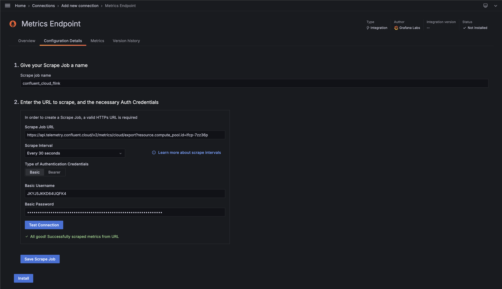
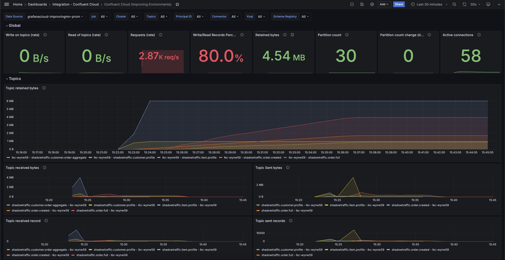

# Observability: Grafana Cloud

Want to integrate the [Confluent Cloud Metrics](https://api.telemetry.confluent.cloud/docs/descriptors/datasets/cloud) into Grafana Cloud? This guide will walk you through that.

1. Sign up for [Grafana Cloud Free Tier](https://grafana.com/products/cloud/).
2. Gather your `MetricsViewer` API Key & Schema Registry ID
   - The `kafka-ops-team/outputs.tf/staging-resource-ids` will emit the MetricsViewer service account details
   - From `~/kafka-ops-team`, run `terraform output staging-resource-ids` (sample output below)
   
    ```text
   ## NOTE: Copy the MetricsViewer API Key & Schema Registry ID for use in Step 4
   
    <<EOT
    Staging Environment ID:   env-w1w123
    Staging Schema Registry ID:   lsrc-123ymj
    Staging Schema Registry Rest Endpoint:   https://psrc-123gzn.us-east1.gcp.confluent.cloud
    Staging MetricsViewer API Key: xxx:xxxxxxx
    Staging EnvironmentAdmin/AccountAdmin API Key:  xxx:xxxxxx
    ```

3. Gather your Cluster ID & Flink Scrape Job URL
   - The `kafka-product-team-{domain}/outputs.tf/resource-ids` will emit the Cluster ID and other details
   - From `~/kafka-product-team-{domain}/staging`, run `terraform output resource-ids`
   
   ```text
   ## NOTE: Copy 'inventory' Cluster ID & Flink Scrape Job URL for use in Steps 4 & 5
   
   <<EOT
   'staging' Environment ID: env-3wgvy0
   'inventory' Cluster ID: lkc-y330rp
   'inventory' Flink Compute Pool ID: lfcp-7zz36p
   'inventory' Cluster Admin: "TIVI3VSW6FVJKMNB:zmrQigHKO6ugX0dGnIJI7a1G94lIxUcEo/QoawLU0vDyJtqPargnXgxxJ8p5KJJj"
    
   ****************************
   Metrics Scrape Job Configs
   ****************************
   Flink Scrape Job URL:   https://api.telemetry.confluent.cloud/v2/metrics/cloud/export?resource.compute_pool.id=lfcp-7zz36p
   Cluster Scrape Job URL: https://api.telemetry.confluent.cloud/v2/metrics/cloud/export?resource.kafka.id=lkc-y330rp
   
   Metrics API Username/Password - RUN `/kafka-ops-team > terraform output staging-resource-ids`
   ...
   ...
   ```

4. Configure a new Confluent Cloud Connection, supplying the API Key & Secret (from Step 2).
   - Add Resources
     - Kafka Cluster: paste the Cluster ID from Step 3
     - Schema Registry: paste the Schema Registry ID from Step 2
   - Docs
     - [Configure Confluent Cloud Connection in Grafana Cloud](https://confluent.cloud/settings/metrics/integrations?integration=grafana)
     - [Confluent Cloud integration for Grafana Cloud](https://grafana.com/docs/grafana-cloud/monitor-infrastructure/integrations/integration-reference/integration-confluent-cloud/#confluent-cloud-integration-for-grafana-cloud)

5. Currently, the Confluent Cloud Connection does not include the Flink resource metrics. However, we can configure Grafana to scrape the Metrics Endpoint for these key data points.
    - Add Connection, "Metrics Endpoint"
    - Enter the Flink Scrape Job URL from Step 3
    - Enter the Staging MetricsViewer API Key from Step 2



6. It may take a few minutes but the default Confluent Cloud dashboard should start showing data as shown below (the Dashboard can be installed when setting up the connection)

> NOTE: The out of the box Confluent dashboard will not expose the Flink Metrics.

