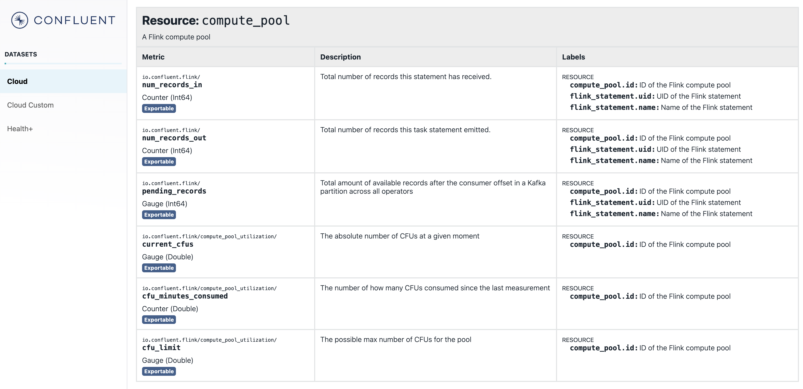

# Confluent Metrics API

Grafana does not natively support gathering the metrics around Flink "resources". However, there are metrics available and the sample cURLs illustrate how to get at them. The [Grafana Cloud Page](./grafana-cloud.md) also details how to leverage these `export` endpoints in a "Metrics Endpoint" connection to get them into Grafana alongside the core Kafka Cluster metrics.



Useful Links
- [Confluent Cloud Metrics](https://api.telemetry.confluent.cloud/docs/descriptors/datasets/cloud)
- [Export metric values](https://api.telemetry.confluent.cloud/docs?_gl=1*oooj3*_gcl_aw*R0NMLjE3MTgxMzI2NDEuQ2p3S0NBanc2NS16QmhCa0Vpd0FqcnFSTUlJR1Y5RXNOR2VTdjBKVURydmZuRjVNTlJ1MURVMHo3WVJDMVIyZ2dqQWZfUEtsbFViVElCb0M2bzBRQXZEX0J3RQ..*_gcl_au*OTMzNzk5NTkuMTcxNTc4MzM3MA..*_ga*MTI1NTQ2NjM1OS4xNjQ1NTUxODAw*_ga_D2D3EGKSGD*MTcyMTE0MDQ5OS4yNzkuMS4xNzIxMTQwNTAwLjU5LjAuMA..&_ga=2.47625445.393834890.1721056199-1255466359.1645551800&_gac=1.27979086.1718132641.CjwKCAjw65-zBhBkEiwAjrqRMIIGV9EsNGeSv0JUDrvfnF5MNRu1DU0z7YRC1R2ggjAf_PKllUbTIBoC6o0QAvD_BwE#tag/Version-2/paths/~1v2~1metrics~1%7Bdataset%7D~1export/get)
- [Example scrape configuration](https://api.telemetry.confluent.cloud/docs?_gl=1*oooj3*_gcl_aw*R0NMLjE3MTgxMzI2NDEuQ2p3S0NBanc2NS16QmhCa0Vpd0FqcnFSTUlJR1Y5RXNOR2VTdjBKVURydmZuRjVNTlJ1MURVMHo3WVJDMVIyZ2dqQWZfUEtsbFViVElCb0M2bzBRQXZEX0J3RQ..*_gcl_au*OTMzNzk5NTkuMTcxNTc4MzM3MA..*_ga*MTI1NTQ2NjM1OS4xNjQ1NTUxODAw*_ga_D2D3EGKSGD*MTcyMTE0MDQ5OS4yNzkuMS4xNzIxMTQwNTAwLjU5LjAuMA..&_ga=2.47625445.393834890.1721056199-1255466359.1645551800&_gac=1.27979086.1718132641.CjwKCAjw65-zBhBkEiwAjrqRMIIGV9EsNGeSv0JUDrvfnF5MNRu1DU0z7YRC1R2ggjAf_PKllUbTIBoC6o0QAvD_BwE#tag/Version-2/paths/~1v2~1metrics~1%7Bdataset%7D~1export/get:~:text=Example%20Prometheus%20scrape%20configuration)
- [Metrics Endpoint Integration](https://grafana.com/docs/grafana-cloud/monitor-infrastructure/integrations/integration-reference/integration-metrics-endpoint/)

## Sample Export cURLS

### Resource: Flink Compute Pool 

```shell
curl --request GET \
  --url 'https://api.telemetry.confluent.cloud/v2/metrics/cloud/export?resource.compute_pool.id=lfcp-123456' \
  --header 'Authorization: Basic base64(key:secret)' \
  --header 'Content-Type: application/json'
```

### Resource: Kafka Cluster

```shell
curl --request GET \
  --url 'https://api.telemetry.confluent.cloud/v2/metrics/cloud/export?resource.kafka.id=lkc-123456' \
  --header 'Authorization: Basic base64(key:secret)' \
  --header 'Content-Type: application/json'
```

## Sample Query cURLs

### Resource: Flink Compute Pool Utilization

Available Metrics:

- `current_cfus`: The absolute number of CFUs at a given moment
- `cfu_minutes_consumed`: The number of how many CFUs consumed since the last measurement
- `cfu_limit`: The possible max number of CFUs for the pool

Sample cURL:

```bash
curl --request POST \
  --url https://api.telemetry.confluent.cloud/v2/metrics/cloud/query \
  --header 'Authorization: Basic base64(key:secret)' \
  --header 'Content-Type: application/json' \
  --data '{
	"aggregations": [
		{
			"metric": "io.confluent.flink/compute_pool_utilization/current_cfus"
		}
	],
	"filter": {
		"op": "OR",
		"filters": [
			{
				"field": "resource.compute_pool.id",
				"op": "EQ",
				"value": "lfcp-6zz708"
			}
		]
	},
	"granularity": "PT1M",
	"intervals": [
		"2024-07-15T13:02:00-05:00/2024-07-15T14:02:00-05:00"
	],
	"limit": 1000
}'
```

### Resource: Flink Statement

Available Metrics:

- `num_records_in`: Total number of records this statement has received.
- `num_records_out`: Total number of records this task statement emitted.
- `pending_records`: Total amount of available records after the consumer offset in a Kafka partition across all operators.

Sample cURL:

```bash
curl --request POST \
  --url https://api.telemetry.confluent.cloud/v2/metrics/cloud/query \
  --header 'Authorization: Basic base64(key:secret)' \
  --header 'Content-Type: application/json' \
  --data '{
	"aggregations": [
		{
			"metric": "io.confluent.flink/pending_records"
		}
	],
	"filter": {
		"op": "OR",
		"filters": [
			{
				"field": "resource.compute_pool.id",
				"op": "EQ",
				"value": "lfcp-6zz708"
			}
		]
	},
	"granularity": "PT1M",
	"intervals": [
		"2024-07-15T13:02:00-05:00/2024-07-15T14:02:00-05:00"
	],
	"limit": 1000
}'
```

### Resource: Kafka Cluster

These metrics are all readily available within Grafana already. However, you can get at them directly via the API too.

```bash
curl --request POST \
  --url https://api.telemetry.confluent.cloud/v2/metrics/cloud/query \
  --header 'Authorization: Basic base64(key:secret)' \
  --header 'Content-Type: application/json' \
  --data '{
	"aggregations": [
		{
			"metric": "io.confluent.kafka.server/received_bytes"
		}
	],
	"filter": {
		"op": "OR",
		"filters": [
			{
				"field": "resource.kafka.id",
				"op": "EQ",
				"value": "lkc-100dq5"
			}
		]
	},
	"granularity": "PT1M",
	"intervals": [
		"2024-07-15T13:02:00-05:00/2024-07-15T14:02:00-05:00"
	],
	"limit": 1000
}'
```